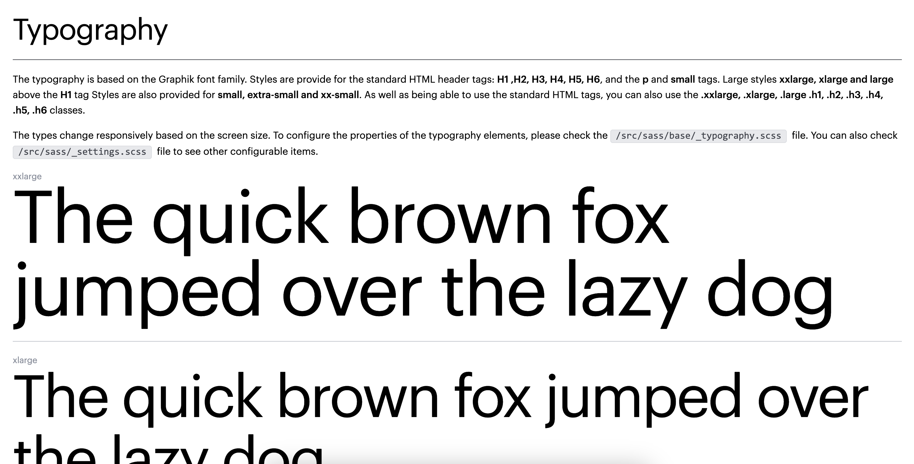

# Website Project for Pastor Chris Online
#### This repository contains the bootstrap code (styles, components and other assets) for the new PastorChrisOnline Website.

To bootstrap this project, simply clone this repository and run ```yarn install``` or ```npm install```. Then proceed to run ```yarn start``` or ```npm start``` to begin the build process.

This project uses The Foundation Framework, Gulp, Pug, Typescript, SASS and Webpack to build and bundle the website.

If you have any question, please don't hesitate to ask

